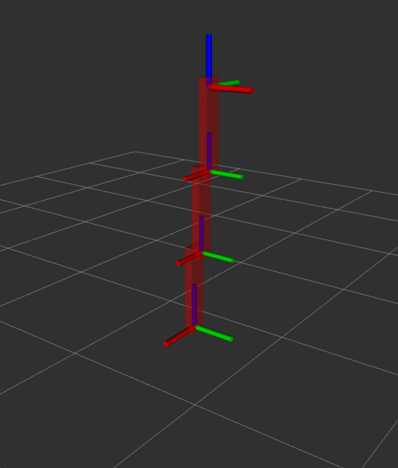

# EasyBot
This is the Repo of the Easybot (ROS Jazzy)
## Usage
1. Do the git clone below (in ros2_ws/src):
```
git clone https://github.com/TW-Robotics/EasyBot.git
```
2. Build your Workspace with (in ros2_ws): 
```
colcon build
```
3. Source you Install directory with (assuming correcting path and using bash):
```
source ~/ros2_ws/install/setup.bash
```
4. Roslaunch the EasyBot (aka easyrobot) with:
```
ros2 launch easyrobot run.launch.py
```


## To-Do
* DH-Convention for EasyRobot
* MoveIt branch with Moveit Configuration
* Different Controllers
* Gazebo Harmonic Integration
