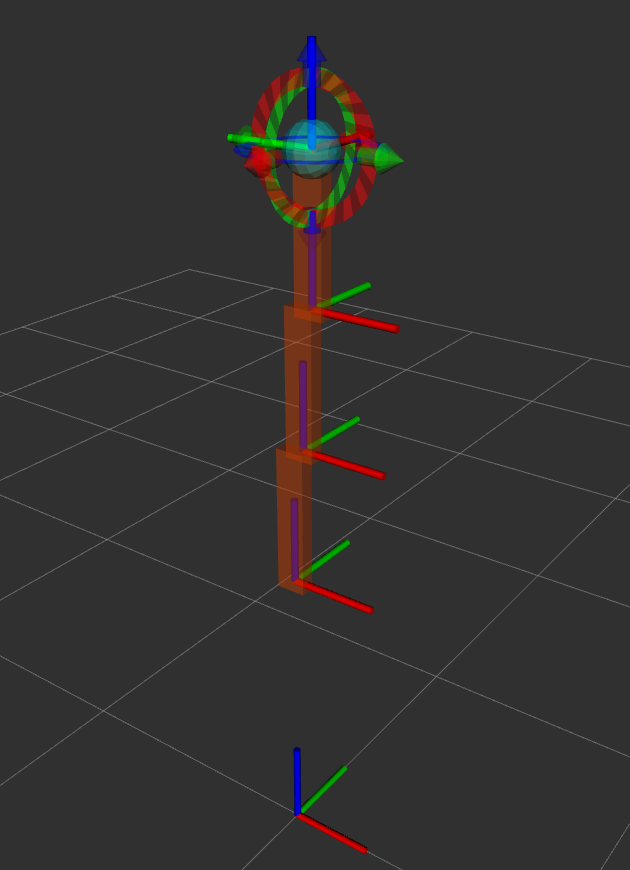
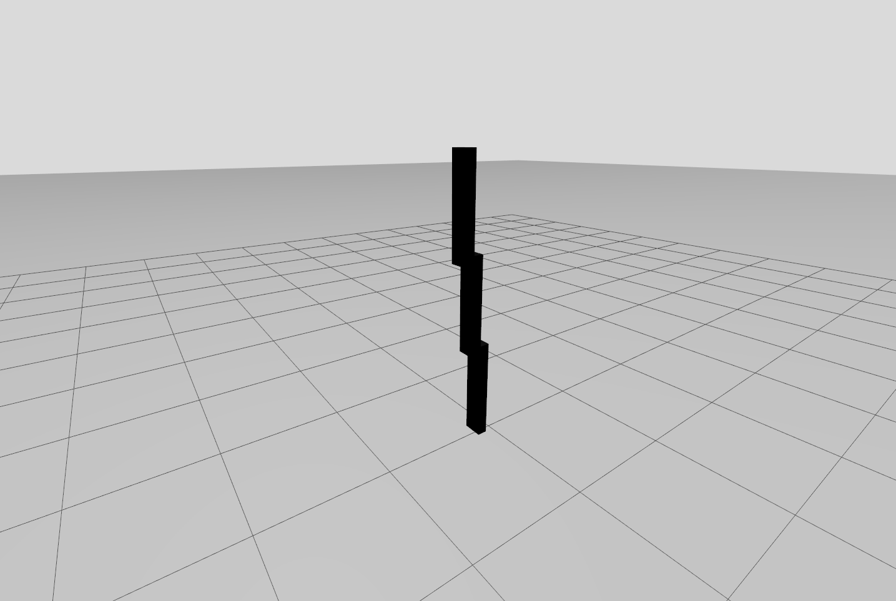

# EasyBot
This is the Repo of the Easybot (ROS Jazzy) with a MoveIt2 Config and Gazebo Harmonic
## Usage
1. Do the git clone below (in ros2_ws/src):
```
git clone https://github.com/TW-Robotics/EasyBot.git
```
2. Install all needed packages and dependancies (assuming ros-jazzy-desktop installation) with:
```
sudo apt install ros-jazzy-ros-gz ros-jazzy-gz-ros2-control ros-jazzy-ros2-control ros-jazzy-ros2-controllers ros-jazzy-moveit ros-jazzy-joint-state-publisher*
```
3. Build your Workspace with (in ros2_ws): 
```
colcon build
```
4. Source you Install directory with (assuming ros2_ws is in your home and you are using bash):
```
source ~/ros2_ws/install/setup.bash
```




## Launching the EasyBot in Gazebo with MoveIt Control (joint_trajectory_controller with position command_interface)
```
ros2 launch easybot_bringup run.launch.py
```
This launches a Gazebo Empty World with the EasyBot spawned 1.0 meters clear of the ground plane

## Launching the EasyBot in Gazebo with MoveIt Control (joint_trajectory_controller with effort command_interface)
```
ros2 launch easybot_bringup run_effort.launch.py
```
This launches a Gazebo Empty World with the EasyBot spawned 1.0 meters clear of the ground plane.

~~**Attention: PID Controller is very poorly optimized, Easybot will struggle to reach most positions with the set goal tolerances! (WIP)**~~

## Issues
* Default Planner has to be choosen in RViz (Context --> OMPL --> Planner Dropdown --> choose RRTConnect)
* Effort Controller poorly optimized 

## To-Do
* ~~MoveIt branch with Moveit Configuration~~
* ~~Different Controllers (velocity and effort planned)~~ Added effort controller
* Optimize PID for Effort controller
* Adding different OMPL Planners for testing
* DH-Convention for EasyRobot
